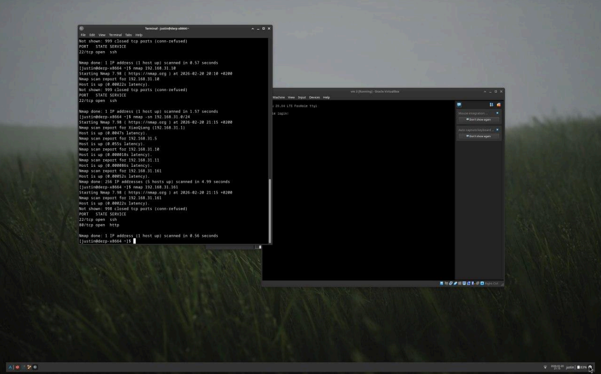
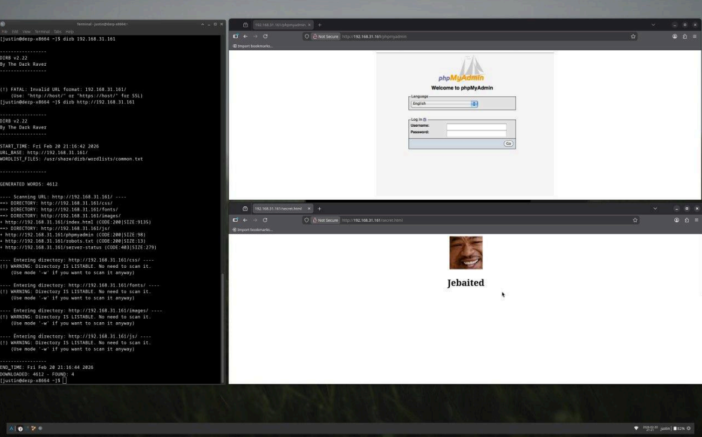
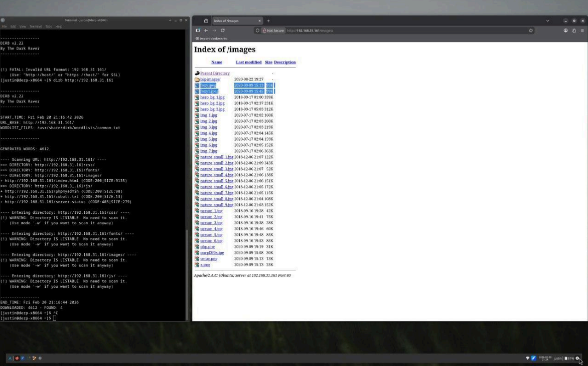
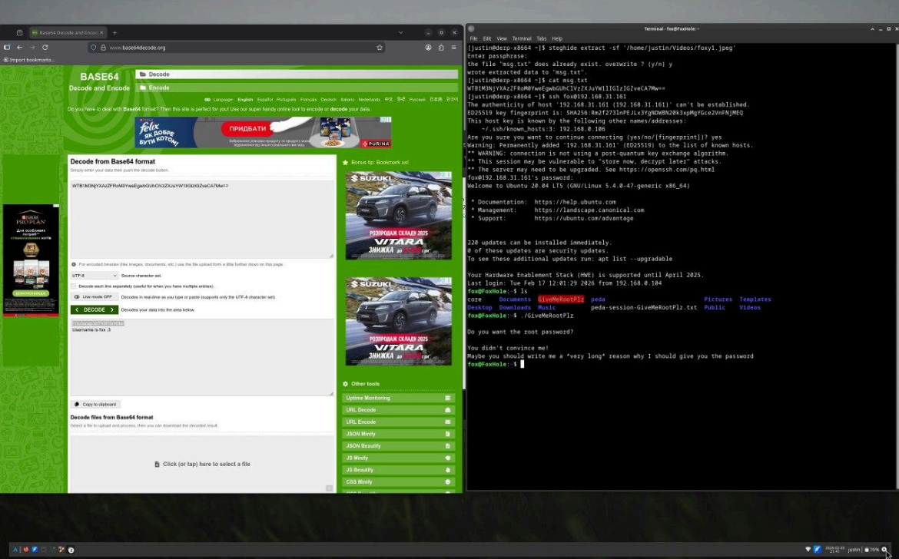
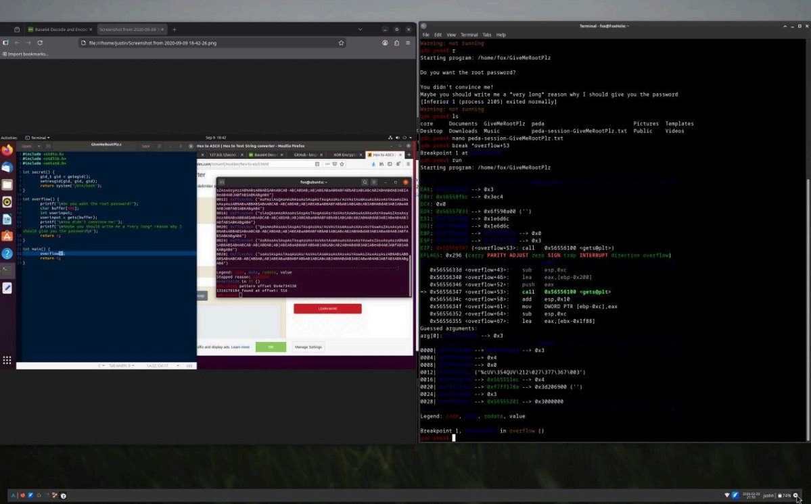
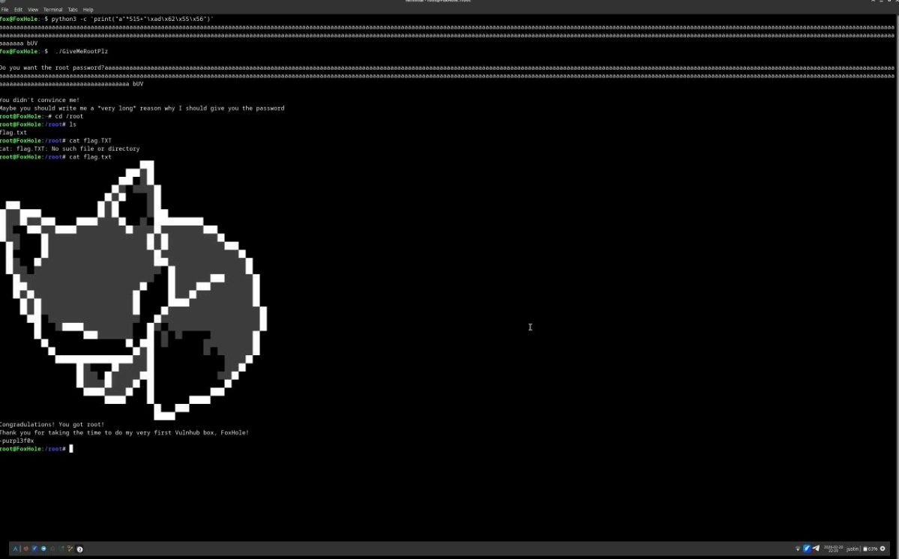

# CTF 5 Writeup

## Reconnaissance

First, I started the machine, found its IP address and performed a scan.

```bash
nmap -sC -sV TARGET_IP
```

To discover hidden directories:

```bash
dirb http://TARGET_IP
```



---

## Web Enumeration

The scan revealed several interesting paths, including:

```
phpmyadmin
```

After visiting the pages it became clear that most of them were decoys.

So I started looking for useful files in the media directory.



---

## Finding the Hidden Data

Two images were found:

```
foxy.jpeg
foxy1.jpeg
```

They looked identical but had different file sizes — this indicated hidden data.



---

## Metadata Analysis

I checked both images:

```bash
exiftool foxy.jpeg
exiftool foxy1.jpeg
```

The metadata was identical, meaning the second image had embedded content.

---

## Steganography

I extracted hidden data from the image and found a Base64 string.

After decoding it:

```bash
echo "BASE64_STRING" | base64 -d
```

I obtained login credentials.



---

## Initial Access

Using the recovered credentials I logged into the machine.

Inside I found a binary/script that was supposed to give root privileges but did not work.

However, screenshots of the program revealed that:

* there is a function called `secret`
* the system has a debugger installed



---

## Binary Analysis

The goal became to trigger the `secret` function.

By analyzing the program in the debugger I found the memory address of this function.

---

## Generating the Correct Input

A Python script was used to generate the required input based on the address of the `secret` function.

```bash
python3 exploit.py
```

This produced the correct password.

---

## Root / Flag

After entering the generated password:

```
Access granted
```

The flag was displayed.



---

## What I Learned

* directory enumeration helps identify hidden content
* file size differences may indicate steganography
* metadata alone is not always enough
* Base64 decoding can reveal credentials
* debuggers allow function-level exploitation
* controlling program flow leads to privilege escalation
