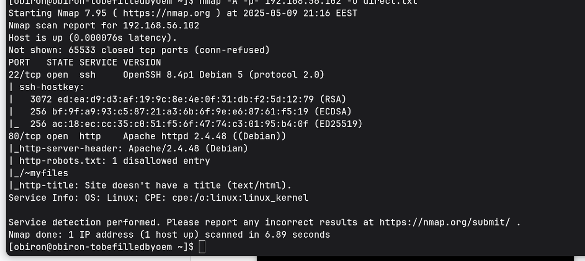

# LupinOne Writeup

## Overview

LupinOne is a vulnerable Linux virtual machine focused on web exploitation and privilege escalation techniques.
The objective was to gain initial access to the system and escalate privileges to root.

---

## Reconnaissance

First, I identified the target on the network and performed a service scan:

nmap -sC -sV 192.168.56.102

The scan revealed a web server running on the machine.

I accessed the website and checked common files such as `robots.txt`, which hinted at hidden content.

---

## Web Enumeration

To discover hidden directories I performed directory brute forcing:

ffuf -w wordlist.txt -u http://192.168.56.102/FUZZ

This revealed the directory:

/secret

Inside the directory I found encoded data referencing an SSH key.

---

## Initial Access

The discovered content appeared to be encoded.
After analysis I determined it was Base58 encoded data.

After decoding I obtained an encrypted SSH private key.

I attempted to crack the key passphrase using JohnTheRipper and successfully recovered credentials:

user: icex64
password: P@55w0rd!

I then accessed the machine:

ssh icex64@192.168.56.102

User access was successfully obtained and the user flag was found.

---

## Local Enumeration

After obtaining SSH access as **icex64**, I began enumerating the system to identify privilege escalation vectors.

I first confirmed the user context:

id

The account was a standard user with no administrative privileges.

I checked sudo permissions:

sudo -l

No sudo permissions were granted.

### Searching for privilege escalation paths

I searched for SUID binaries:

find / -perm -4000 -type f 2>/dev/null

No obvious misconfigurations were discovered.

I inspected scheduled tasks:

cat /etc/crontab

No writable cron jobs were present.

I reviewed file ownership and writable files but found nothing exploitable.

---

## System Information

Next, I checked the kernel version:

uname -a

The machine was running an outdated Linux kernel.

Since common privilege escalation vectors (sudo, SUID binaries, cron jobs, writable files) were not viable, I researched known vulnerabilities affecting this kernel version.

I identified the system as vulnerable to:

CVE-2022-0847 — DirtyPipe

---

## Privilege Escalation

DirtyPipe allows overwriting read-only files and gaining elevated privileges.

I compiled and executed the exploit and spawned a privileged shell.

whoami

Output:

root

Root access was successfully obtained and the root flag was retrieved.

---

## Conclusion

This machine demonstrates how multiple small issues can lead to a full system compromise:

* Sensitive data exposed on the web server
* Recoverable SSH credentials
* Outdated and vulnerable kernel

Proper patching, secure storage of credentials, and restricting access to sensitive files would have prevented the compromise.

